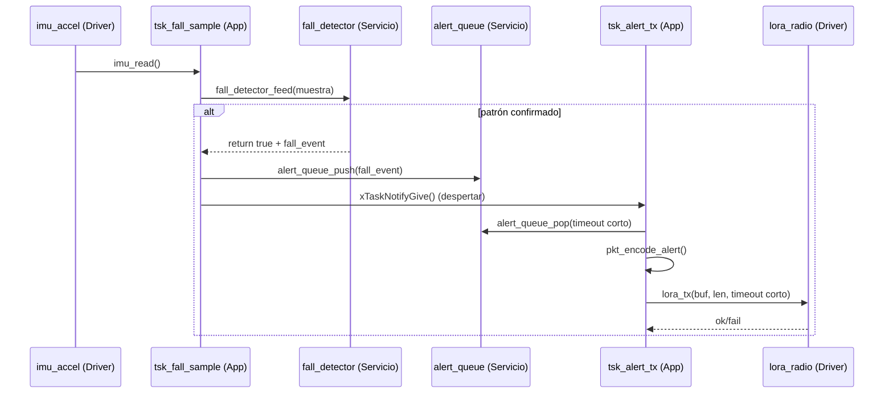

# A3 — Arquitectura por Capas y Comunicación Extremo a Extremo
*(Proyecto: Alerta “Hombre Caído” — RT crítico)*

Este documento detalla **capas, responsabilidades, contratos (APIs), flujos de comunicación, temporización RTOS, manejo de errores y pruebas** para el A3. Sirve como guía de implementación y referencia para todo el equipo.

---

## 0) Visión general
- **Drivers (HAL):** interacción directa con hardware (IMU, LoRa, GPIO/LED, timers, WDT). Sin lógica de negocio.
- **Servicios (Dominio):** detección de caídas, empaquetado/CRC, colas de eventos. No tocan hardware, sólo datos.
- **Aplicación (App):** orquestación RTOS: creación de tareas, prioridades, estados (INIT/RUN/ERROR), política de reintentos, logging.

> Regla de dependencia: **App → Servicios → Drivers**. Nunca al revés.

---

## 1) Drivers (Hardware Abstraction Layer)
**Responsabilidad:** primitivas mínimas, deterministas y con **timeouts explícitos** cuando bloquean.

**Módulos típicos**
- `imu_accel`  
  - `bool imu_init(void);`  
  - `bool imu_read(accel_raw_t* out);`  // lectura cruda, O(µs–ms)
- `lora_radio`  
  - `bool lora_init(uint32_t freq, uint8_t sf, uint8_t bw, int8_t pwr_dbm, bool crc_on);`  
  - `bool lora_tx(const uint8_t* buf, size_t len, uint32_t timeout_ms);`  
  - `bool lora_rx(uint8_t* buf, size_t maxlen, uint32_t timeout_ms);`
- `gpio_led`, `timers`, `watchdog` (según plataforma).

**Reglas**
- Sin `printf` en hot path, sin asignación dinámica.  
- Errores por códigos / `bool`. Nada de políticas o reintentos aquí.  
- Documentar **peor caso** temporal de cada primitiva.

---

## 2) Servicios (Lógica de Dominio)
### 2.1 `fall_detector`
- **Entrada:** `accel_raw_t` o norma |a| en g (según helper).
- **Salida:** `fall_event_t` cuando se confirma patrón **pico + inmovilidad**.
- **API:**
```c
typedef struct { int16_t ax, ay, az; } accel_raw_t;

typedef struct {
  uint32_t epoch;
  int16_t  ax_peak_centi_g;
  uint16_t idle_ms;
} fall_event_t;

typedef struct {
  float Athr_g;       // ~2.2
  float Ithr_g;       // ~0.2
  uint16_t Tidle_ms;  // 500..2000
  uint8_t fs_hz;      // 50..200
} fall_cfg_t;

void fall_detector_init(const fall_cfg_t* cfg);
bool fall_detector_feed(const accel_raw_t* s, fall_event_t* out_event);
```
- **Complejidad y tiempo:** O(1) por muestra, sin bloqueos.

### 2.2 `alert_queue`
- Desacopla detector (evento) de radio TX.
```c
void alert_queue_init(size_t capacity);
bool alert_queue_push(const fall_event_t* e);                 // ISR-safe si aplica
bool alert_queue_pop (fall_event_t* e, uint32_t timeout_ms);  // timeout corto
```

### 2.3 `pkt_codec` (uplink)
- Empaqueta/decodifica alertas, calcula CRC, maneja `TYPE=0xFA`.
```c
size_t pkt_encode_alert(const fall_event_t* e, uint8_t* out, size_t max);
bool   pkt_decode_alert(const uint8_t* in, size_t len, fall_event_t* e);
```

**Principio:** servicios no conocen hardware; sólo estructuras de datos.

---

## 3) Aplicación (RTOS y Orquestación)
### 3.1 Nodo móvil (portátil)
| Tarea              | Función                                   | Disparo                | Prioridad |
|--------------------|-------------------------------------------|------------------------|-----------|
| `tsk_fall_sample`  | Lee IMU, filtrado ligero                  | Timer 100–200 Hz       | ALTA      |
| `tsk_fall_detect`  | FSM “pico + inmovilidad”                  | Notificación/cola      | MUY ALTA  |
| `tsk_alert_tx`     | Pop cola, empaqueta, **LoRa TX**          | Evento (cola)          | MÁXIMA    |
| `tsk_housekeeping` | LED/estado/log no crítico                 | 1–2 Hz                 | BAJA      |

**Objetivo RT:** Confirmación → `lora_tx()` **≤ 300 ms** (límite A3: < 1 s).

### 3.2 Nodo receptor
- `tsk_lora_rx` (ALTA): `lora_rx()` + `pkt_decode_alert()`  
- `tsk_ui` (MEDIA/BAJA): imprime/LED

### 3.3 Estados
`INIT → RUN → ERROR(retry)`.  
- INIT: init drivers + crear tareas/colas/timers.  
- RUN: operación normal.  
- ERROR: backoff, LED, reintentos.

### 3.4 Reintentos y timeouts
- `lora_tx()` con timeout corto (p.ej. 50–100 ms).  
- Backoff exponencial breve (50 → 100 → 200 ms), sin bloquear a detectores.  
- Nunca bloquear indefinidamente.

---

## 4) Comunicación entre capas y tareas
### 4.1 Sampleo → Detección
- **Opción B (recomendada):** `tsk_fall_sample` llama directamente `fall_detector_feed()`; si confirma, empuja evento a `alert_queue` y notifica a `tsk_alert_tx` (menor jitter).

### 4.2 Detección → TX
- `alert_queue_push(event)` → `tsk_alert_tx` hace `pop` inmediato y `pkt_encode_alert()` → `lora_tx()`.

### 4.3 ISR/Timers
- Si el IMU tiene interrupción por pico, ISR sólo **despierta** la tarea de detección (trabajo en tarea).  
- Timer periódico si no se usa interrupción.

### 4.4 Nodo móvil ⇄ Receptor
- Unidireccional en MVP (sin ACK). Receptor valida CRC y muestra alerta.

---

## 5) Diagramas

### 5.1 Bloques
```mermaid
flowchart LR
  subgraph APP_NodeMovil[Aplicación Nodo Móvil]
    A1[tsk_fall_sample] -->|muestras| S1[fall_detector (Servicio)]
    S1 -->|evento caída| Q[alert_queue (Servicio)]
    A2[tsk_alert_tx] -->|pop evento| P[pkt_encode (Servicio)]
    P -->|buffer| D2[lora_radio (Driver)]
  end

  subgraph HW_NodeMovil[Hardware/Drivers]
    D1[imu_accel (Driver)]
    D2[lora_radio (Driver)]
  end

  A1 <---> D1
  D2 -.LoRa P2P.-> R2

  subgraph RECEPTOR
    R2[lora_radio (Driver)] --> RP[pkt_decode (Servicio)] --> RU[tsk_ui (App)]
  end
```

### 5.2 Secuencia (evento de caída → TX)


---

## 6) Tiempo real y garantías
- Priorización: `TX > Detect > Sample > Housekeeping`.
- Menos hops (Opción B) para reducir latencia y jitter.
- Timeouts cortos y backoff sin bloquear detectores.
- Buffers de tamaño justo (4–8 eventos). Sin `printf` en hot path.
- Watchdog alimentado por tareas principales.

---

## 7) Manejo de errores
- Drivers retornan error; App decide política (reintentos/backoff/ERROR).
- Contadores de fallos y último código en variables atómicas/volátiles.
- LED patrón en `ERROR` + reintentos periódicos.

---

## 8) Pruebas
**Unitarias (Servicios):**
- `fall_detector_feed` con trazas sintéticas (pico + idle).  
- `pkt_encode/decode` con vectores dorados y CRC.

**Integración:**
- Smoke IMU→Detector→Queue→TX→RX→UI.  
- Medición de latencia: timestamp de confirmación vs. `lora_tx()`.

**Fakes/Mocks:**
- IMU fake con señales grabadas.  
- Radio fake que induce `BUSY` para validar backoff.

---

## 9) Configuración (una sola verdad)
- `config/fall_params.h` (umbrales, ventanas).  
- `config/radio_params.h` (freq=915e6, SF7, BW125k, Pout 15 dBm, CRC).  
- `FreeRTOSConfig.h` (stacks, colas, prioridades).

---

## 10) Checklist (MVP)
- [ ] Drivers `imu_accel` y `lora_radio` con timeouts.  
- [ ] `fall_detector` estable con params por defecto.  
- [ ] `alert_queue` + `pkt_encode_alert`.  
- [ ] Tareas + timers 100–200 Hz configurados.  
- [ ] Confirmación → `lora_tx()` ≤ 300 ms.  
- [ ] Receptor decodifica y muestra alerta.

---

## 11) Glosario breve
- **Hot path:** ruta de ejecución crítica para el RT.  
- **Backoff:** espera incremental entre reintentos.  
- **FSM:** máquina de estados finitos.

